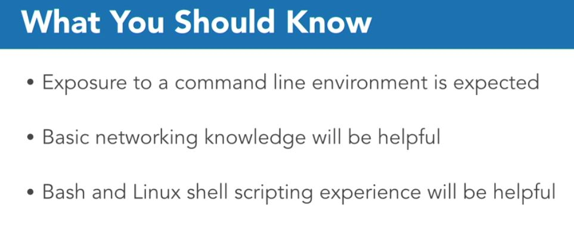
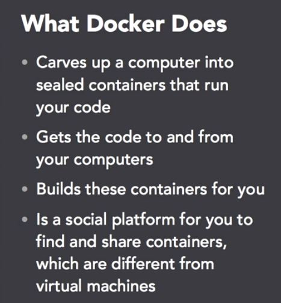
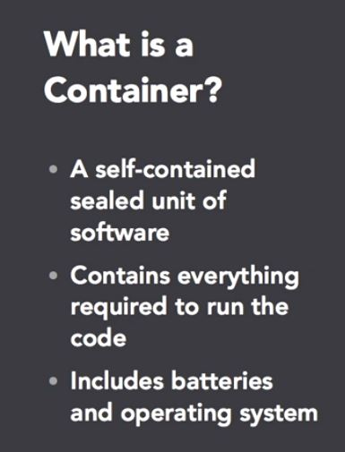
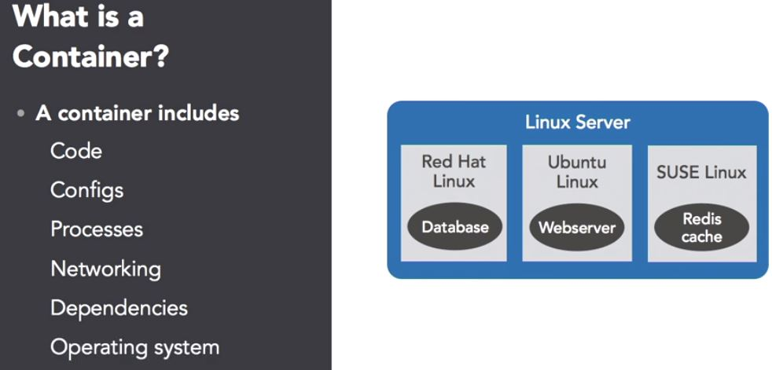
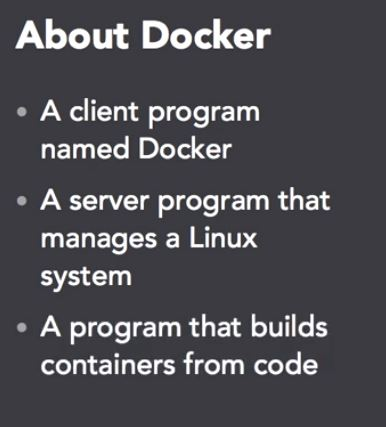
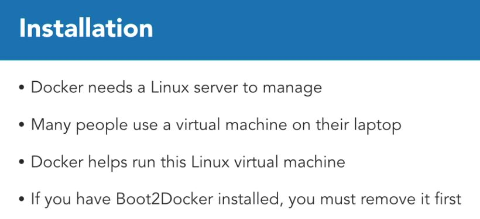

# Learning Docker

## Introduction


> ### What is Docker?





## 1. Installing Docker
> ### Setting up Docker


- Points

- Codes
    ```python

    ```
> ### Docker Toolbox
- Points
    -
- Codes
    ```python

    ```
> ### Insatll Docker on Windows
- Points
    -
- Codes
    ```python

    ```
> ###Insatll Docker on Mac
> ###Insatll Docker on Linux

## 
> ###
- Points
    -
- Codes
    ```python

    ```
> ###
- Points
    -
- Codes
    ```python

    ```
> ###
- Points
    -
- Codes
    ```python

    ```
> ###
- Points
    -
- Codes
    ```python

    ```
> ###
- Points
    -
- Codes
    ```python

    ```
> ###
- Points
    -
- Codes
    ```python

    ```
## 
> ###
- Points
    -
- Codes
    ```python

    ```
> ###
- Points
    -
- Codes
    ```python

    ```
> ###
- Points
    -
- Codes
    ```python

    ```
> ###
- Points
    -
- Codes
    ```python

    ```
> ###
- Points
    -
- Codes
    ```python

    ```
> ###
- Points
    -
- Codes
    ```python

    ```

## 
> ###
- Points
    -
- Codes
    ```python

    ```
> ###
- Points
    -
- Codes
    ```python

    ```
> ###
- Points
    -
- Codes
    ```python

    ```
> ###
- Points
    -
- Codes
    ```python

    ```
> ###
- Points
    -
- Codes
    ```python

    ```
> ###
- Points
    -
- Codes
    ```python

    ```

## 
> ###
- Points
    -
- Codes
    ```python

    ```
> ###
- Points
    -
- Codes
    ```python

    ```
> ###
- Points
    -
- Codes
    ```python

    ```
> ###
- Points
    -
- Codes
    ```python

    ```
> ###
- Points
    -
- Codes
    ```python

    ```
> ###
- Points
    -
- Codes
    ```python

    ```

## 
> ###
- Points
    -
- Codes
    ```python

    ```
> ###
- Points
    -
- Codes
    ```python

    ```
> ###
- Points
    -
- Codes
    ```python

    ```
> ###
- Points
    -
- Codes
    ```python

    ```
> ###
- Points
    -
- Codes
    ```python

    ```
> ###
- Points
    -
- Codes
    ```python

    ```

## 
> ###
- Points
    -
- Codes
    ```python

    ```
> ###
- Points
    -
- Codes
    ```python

    ```
> ###
- Points
    -
- Codes
    ```python

    ```
> ###
- Points
    -
- Codes
    ```python

    ```
> ###
- Points
    -
- Codes
    ```python

    ```
> ###
- Points
    -
- Codes
    ```python

    ```