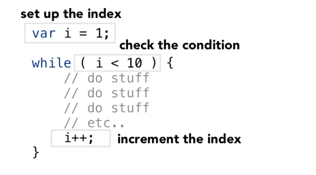
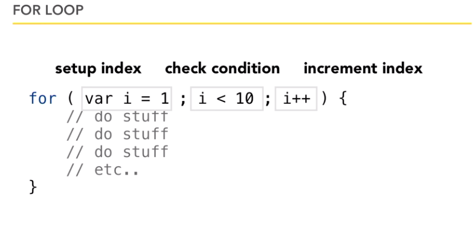
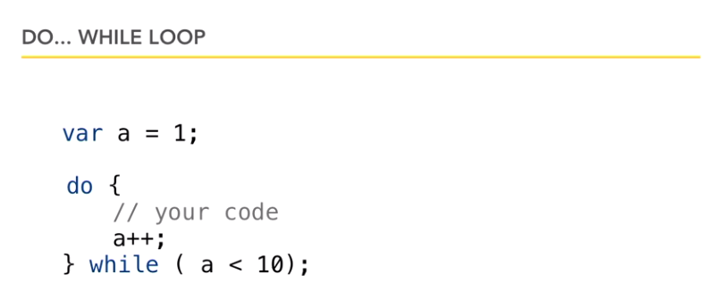
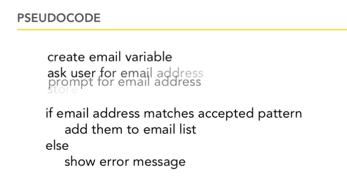
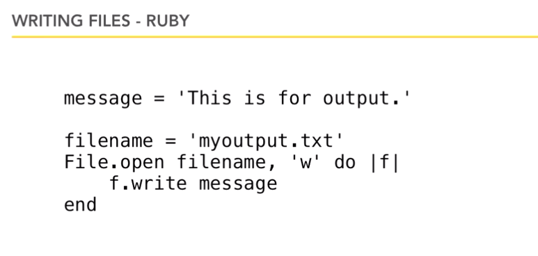

- This is  a Repo for Practe of Course => https://www.lynda.com/Programming-Foundations-tutorials/Foundations-Programming-Fundamentals/83603-2.html
- Below is my course note including two section
    - key points of the section
    - code show in the course

# Programming_Fundation_Course_Practice_Code


## Chapter 3 Variables and Data Types
> ### Introduction to Variables and data types
- Points
    - 变量命名不可以以数字开头
    - Case Sensitive

- Command happen in this section
    ```javascript
        var year;
        var year = 2019;
        var year,month,day;
        var year = 2019, month =05, day = 31;
    ```
> ### Understanding strong weaak and duck-typed languages
- Ponints
    - Javascript is weak type language
        - Flex but no gurantee
- Command happen in this section
    ```javascript
        var myVariable;
        myVariabel = 200; //num 
        myVariabel = "Hello"; //string
        myVariabel = 'Hello'; //string 2
        myVariabel = true; //boolean
    ```
> ### Working with numbers
- Ponints
    - 123 == 123.123 in javascript
    - 123!== "123"
    - 123 ~== 123.123 in some other language
- Command happen in this section
    ```javascript
        var a;
        a = 5;
        a = 10000;
        a = 123.3265;
        a= -500;
        alert(a);
    ```
> ### Using characters and stings 
- Ponints
    - javascript 允许“” 和 ‘’ 定义string 但是大部分其他语言只允许“” 所以保持使用“”定义String的习惯
    - 特殊情况 括号中有括号的情况
        - Escaping 符号 **backslash**
- Command happen in this section
    ```javascript
    
    ```
> ### Working with operators
- Ponints
    - + - / *
    - += -= *= /= ++
- Command happen in this section
    ```javascript
    var a = 1;
    var b = 50;
    var res = a + b;
    res = a + b * 10;
    res = (a + b)*10;
    res = res + b;
    res += 10;
    res++
    ```
> ### Properly using white space
- Ponints
    - dont car about the whitspace and line break and indent
    - Make sense to coder
    - Be nie to mate
    - fllow the common style
    - **make code clar with high readability**
- Command happen in this sectio
    ```javascript
        var a = 1;
        var a      =1 ;
        a++;
        a ++;
        a + +;//this is wrong space matnters 1
        a = "hell osadla dffdsd  sda  "//this is wrong space matters 2
        a = "1st line 
        2nd dline" // wrong way to add new line
        a = " 1st |n 2nd "//right way to do it
        alert("Hello, " + a);
    ```
> ### Adding comments to code for human understanding
- Ponints
    - **make code clar with high readability**
- Command happen in this section
    ```javascript
        // This is how we make comment in javascript
    ```

## Chapter 4 Writing conditional code
> Ps rename a file in git command ``git mv NAMEA NAMEB`` 
>### Building with the if statement
- Ponints
    - ( pawrenthesess )
    - [ brackets ]
    - { braces }
    - c = 9 //This is a assignment
    - c == 99
    - c === 99
- Command happen in this section
    ```javascript
        if ( condition ) { // condition will finally boil down to single T/F 
            alert("Peace & Love");
            //code in here
        } // **don not need put a ; after {}**
    ```
>### Working with complex conditions
- Ponints
    - dont nested over 3 level
- Command happen in this section
    ```javascript
        if ( balance >= 0) {
        alert("The balance is positive");
            if ( balance > 1000 ) {
                alert("The balance is huge");
            }
        } else {
            alert("The balance is Negative");
        }
    ```
>### Setting comparison operators
- Ponints
    - if ( a = b ) this situation its will foever be true
    - = assignment
    - == equality
    - === Strict equality
    - !== != > < >= <=
- Command happen in this section
    ```javascript
        var a = 123;
        var b = "123";
        a == b //this will be true
        a === b //this is false
        if ( a===b $$ c == d)
        if ( (a===b) $$ (c == d))
        if ( a===b || c == d)
    ```
>### Using the switch statement
- Ponints
    -
- Command happen in this section
    ```javascript
        
    ```
>### Using the switch statement
- Ponints
    - multipe if ifelse
- Command happen in this section
    ```javascript
        switch ( grad ){
            case "Regular":
                alert("");
                break; //this is to avoid uselss energy consume 
            case 2:
                alert("");
                break;
            case "asd": 
                alert("");
                break;
            default :
                alert("That is note a valid grade");
        }

    ```
## Chapter 5 Modular Code
>### Brasking your code apart
- Ponints
    - make your code Functions 
    - call it then it will excute
    - will scan your code to memorty your function first
    - define your fun before you call them
- Command happen in this section
    ```javascript
        function FUNCTIONNAMEULIKE ( parameters ) {
            //body
        }
        functionName();//CALL IT
    ```
>### Creating and calling functions
- Ponints
    - function will be execute unitll u call it
    - functionName();
    - can be called multilple times
    - can be called by itself
- Command happen in this section
    ```javascript
        
    ```
>### Setting parameters and arguments
- Ponints
    - arguments vs parameters
    - pase va back using return
- Command happen in this section
    ```javascript
        function FUNCTIONNAMEULIKE ( parameters1,parameters2 ) {
            var a = parameters1;
            var b = parameters2;
            alert("Love")
            //body
        }
        functionName( 5,10);//CALL IT her 5,10 is arguments
        functionName( 5,10);//CALL IT
        alert(“asdgsd“)；
        function FUNCTIONNAMEULIKE ( parameters1,parameters2 ) {
            var a = parameters1;
            var b = parameters2;
            alert("Love")
            return a + b; //after this code exe all function done
            //body
        }
        var c = FUNCTIONNAMEULIKE(7,7);
        alert(c)
        var name = prmomt("what is your name")//inbuilt funciton
    ```
>### Understanding variable scope
- Ponints
    - where is var available
    - Scope maters where
- Command happen in this section
    ```javascript
        function FUNCTIONNAMEULIKE ( parameters1,parameters2 ) {
            var a = parameters1;
            var b = parameters2;
            alert("Love")
            return a + b; //after this code exe all function done
            //body
        }
        alert(a)//undefined
        function FUNCTIONNAMEULIKE ( parameters1,parameters2 ) {
            var a = parameters1;
            var b = parameters2;
            alert("Love")
            return a; //after this code exe all function done
            //body
        }
        alert(a) //work
    ```
>### Splitting code into different files
- Ponints
    - Group several similar function into one files
    - Order of import so care the dependence ！！##
- Command happen in this section
    ```javascript
        <script src="NAME1.js"></script>
        <script src="NAME2.js"></script>
    ```
## Chapter 6 Iteration Writing Loops
>### Introduction to iteration
- Ponints
    - Programming buzzword for a loop
    - when to stop is mater
- Command happen in this section
    ```javascript
        ```
        var index =;
        while (index > condition){
            //cod boy
            index++;
        })
        ```

    ```
>### Writing a while statement
- Ponints
    - Care your increment logic
    - fencepost error //off by one error care this
    - clear your logic first
- Command happen in this section
    ```javascript
        var amount = 0;        var i = 1;
        while( i<10 ){
            amount = amount + 100;
            //increment index
            i++
        }
        alert(amount);
    ```
>### Creating a for loop
- Ponints
    - Setup index 
    - check condition
    - increment index
    - do_while have a ; after while
- Command happen in this section
    
    
    
## More About Strings
>### Cleaning up with string concatenation
- Ponints
    - var foo = "55";
    - var number = Number(foo); //make it a number built in Fun
    - isNan(foo);
    - weak type != dont care the type
    - 5 + "5"
    - 5 + 5
    - 5 * "b" NaN 
- Command happen in this section
    ```javascript
        var foo = "55";
        var myNumber = Number(foo);

        if(isNaN(myNumber)){ //built in function
            alert("not a number");
        }

        if(！isNaN(myNumber)){ //built in function ！ Neg Fun !!
            alert("not a number");
        }
    ```
    ```
>### Find patterns in strings
- Ponints
    - var phrase = "a d fxcvx sdf "
    - phrase.length
    - .toUpperCase()
    - String is a object with a lot powerful function
    - .indexOf("asda")// X firssst index of the string or -1 if not exist
    - .lastIndexOf("asdsafs")
    - .slice(6,11)// 0 based indexs system 11 is not include !!6 7 8 9 10
    - subsring() substr()
    - Command happen in this section
    ```javascript
        var s1= "Hello";
        var s2 = "HeLLo";
        s1 != s2 now
        but s1.toUpperCase() == s2.toUpperCase()//常用逻辑 Common usage

        var s3 = "ilkjasid"
        var s4 = "Ilkjasid"
        s2 < s3
        s2 > s4 //because A < b
        //compare two string 
    ```
>### Introduction to regular expressions
- Ponints
    - Bilit into programming language
    - 2 part
        - Create expree
        - applu it 
    - have some online resourse / template email address
- Command happen in this section
    - know how to use it dont focus on details
    ```javascript
        var myRE = /hello/;
        var myRE = new RegExp("hello");
        myRE.test(string);// Yes or Not
        /^/ //at start
        /$/ //at the end
        /+/ //once or more
        /*/ //zero or more
        /?/ //zero or one
        | //or
        .. //any char
        \w 
        []
        \b
    ```
## Chapter 8 COLLECTION
>### Woeking with arrays
- Ponints
    - N value > one Var
    - 0 base index most languge
    - no size limited
- Command happen in this section
    ```javascript
        var multipleValue = [];
        multipleValue[0] = 5;
        multipleValue[1] = 55;
        multipleValue[2] = "sadf";
        multipleValue[0];
        var multipleValue = [1,2,5,"asdfgw"];
    ```
>### array behaviour
- Ponints
    - Array has strong in bulit behaviour
    - Array.length
    - method are function belong to object
    - **Mozilla Find the right reference** javascript
    - Ability to find
- Command happen in this section
    ```javascript
        Array.length// ！=index
        Object.method();
        .revrse();
        sort();
        join();
        pop();
        push();
    ```
>### iterating throuogh collections
- Ponints
    - basic loop work too
- Command happen in this section
    ```javascript
        for(var i = 0;i < myArray.length;i++){
            XXXX
        }
    ```
>### Collections in other languages
- Ponints
    - Not all languague allow all type in single arry
    - mutable/immutable array
    - key:vale **associative arrays**
- Command happen in this section
    ```javascript
        
    ```
## Chapter 9 Programming Style
>### Programming Style
- Ponints
    - **Style guide lines**
    - C-based language
    - **camelCase** in javascript
    - whitspace {} indention
    - pretend var is required
    - Yahoo Google Mozilla **Be consistent**
- Command happen in this section
    ```javascript

    ```
>### Writing pseudocode
- Ponints
    - writen programing langeuage in plain english
    - dont bother coding skill details focus on outline
- Command happen in this section
    
## Chapter 10 Input and Output
>### Input/Output and persistence
- Ponints
    - Interact vague
    - **persistence saving the state of program**
    - javascfript 基于web开发 处于安全问题不提供直接写入disk的功能
- Command happen in this section


>### Reading and writing from the DOM
- Ponints
    - Script language
    - got at **grab**  DOM **Document Object Model**
- Command happen in this section
    ```javascript
        Objects nested [x]
        var headline = document.getElementById("Peace");
        headline.innerHTML = "Well a new one";  //oiginal html note change
    ```
>### Event Driven programming
- Ponints
    - react for the user responding
    - Events
        - page load
        - move mouse
        - leave
        - extra
        - onload
        - onclick
        - onmouserover
        - onblur //leave the field
        - onfocus
    - find the one u care about and react on that action
- Command happen in this section
    ```javascript
        var headline = document.getElementById("Peace");
        headline.onclick = function(){
            headline.innerHTML = "Well a new one";
        };
    ```
>### Introduction to file I/O
- Ponints
    - Open read close
    - details still need learn
    - one chunck a time
        - while file has lines left
        - ...
        - Streams load don need care position just care the data
- Command happen in this section
    


## Chapter 11 When things Go Wrong
>### Introduction to debugging
- Ponints
    - Mistake is can not be avoid calmd down and fix them
    - syntx errors
    - ; !== :
    - Complie vs interpret ----Compile language will spot this problem before run them
    - Logic  issues
- Command happen in this section
    ```javascript
        
    ```
>### Tracing through a section of code
- Ponints
    - One low tch debug
    - function chain example
    - typo a **typographical error.**
    - Trace message
- Command happen in this section
    ```javascript
        console.log("Bug finder 1")
        aler("Bug finer2");//just about to call ？（Name） function
    ```
>### Understanding error messages
- Ponints
    - Browser have inbuilt function to spot the error in your code but will not directly display in your html render page   
- Command happen in this section
    ```javascript
        Console.log();
        use your console panel;
    ```
>### Using debuggers
- Ponints
    - Firbug firfox inbuilt debugger
    - some amazzing functions are step by step buttom
    - allow you to jump out of a loop dirctly
- Command happen in this section
    ```javascript
        
    ```
## Chapter 12 Introduction to Object Orientation
>### Introduction to OO languages
- Ponints
    - class 
        - It is the blue print,the definition,the description
            -attributes/properties
            - behavior/methods
    - object 
        - Things itsellf
    - encapsulation
        - self-contained uniits that represent both the data
- Command happen in this section
    ```javascript
        
    ```
>### Understanding classes and objects
- Ponints
    - Objective != primitives
        - primitives are just values
        - In javascript string is just act like a object but actually not
        - javascript is not a purest of oo languages
    Objectives are independent of each outer
- Command happen in this section
    ```javascript
        var today = new Date();
        var y2k = new Date(2019,0,1);
        today.getMonth();
        today.getDay();
        tday.getDate();
        today.setMonth();
        today.setDay();
        tday.setDate();//mainly maintan data just plus some behaviour
        Math object //mainly maintain behavior
        Math.round(x);// Math.max() Math.PI Math.random,() Math.sqrt() Math.log()
        var myArray = [1,2,3]
        var myArray = new Array(1,2,3)//short cut
    ```
>### Reviewing o-o languages
- Ponints
    - OO programming is above all an idea 
    - C is not a programming language is as it predates the time of OO
    - Ruby is perhaps the pures oo language here
    - Bear in mind finding out about existing class is nor a thankless task
- Command happen in this section
    ```javascript
        
    ```
## Chapter 13 Advanced Topics
>### Memory management across languages
- Ponints
    - Key points not mention in javascript **Memory**
    - manual  Assembly language C
    - Reference_Counting C++ Objective C
    - Grbage collection Java and higher
    - Automatic Javascript
- Command happen in this section
    ```javascript
        
    ```
>### Introductino to algorithms
- Ponints
    - A series of steps to caccomplish a task
- Command happen in this section
    ```javascript
        Bubble sort
        Most labguage have built in them for u to do sort
    ```
>### Introduction to mulitithreading
- Ponints
    - Multitasking
    - Multithreading Do multile things inside one program
        - main thread of execution
- Command happen in this section
    ```javascript
        ?? concept not clear get need go back to this later
    ```
## Chapter 14 Exploring the languages
>### INtroduction to languages
- Ponints
    - COBOL banking system
    - OO? C I? W t?S T? Traget?General purpose?
- Command happen in this section
    ```javascript
        
    ```
>### C-based languages
- Ponints
    - "The C programming Language K&R"
- Command happen in this section
    ```javascript
        
    ```
>### The java world
- Ponints
    - enormously oo language
    - with enormous library called the Java Class Library
    - hybrid compilation model -- bytecode != intermediate Language(Microsoft IL)
    - Java Virtual Machine JVM
    - in Java everything is in a class
- Command happen in this section
    ```javascript
        
    ```
>### .NETlanguage C# and VS .NET
- Ponints
    - Look differen but much part is same
    - OO language
    - hybr- intermediate Language(Microsoft IL)
    - Command happen in this section
    - ,NET runtime
    - Class main()
    - C world is whitespace insensitive
    - VB is not a C based language
    - ASP.NET is not a language just mean you are developing a st using mc platform meand c# or vb.net
    ```javascript
        
    ```
>### Ruby
- Ponints
    - Purest oo language even int bollean is obect
    - Created in japan
    - interpereter
    - Ruby in rails 
- Command happen in this section
    ```javascript
        
    ```
>### Python
- Ponints
    - interpereter
    - have a large library
    - care about the indention
- Command happen in this section
    ```javascript
        
    ```
>### Objective-C
- Ponints
    - OO version of C
    - interpreter ;anguage
    - Ns history reason
- Command happen in this section
    ```javascript
        
    ```
>### Libraries and frameworks
- Ponints
    - know how to find the right code is important than writ it all by self
- Command happen in this section
    ```javascript
        
    ```

## Conclsion
